# 02. L3VPN

## 2.1 VRF インスタンス設定

!!! abstract "ゴール"

    VRF インスタンスを設定すること

PEルータ（C8102-1 ~ C8102-3）に VRF インスタンスを設定します。今回は、全て同じ設定を行います。

<pre class="cli"><code>vrf CustA
 address-family ipv4 unicast
  import route-target
   100:100
  !
  export route-target
   100:100
  !
 !
!</code></pre>

## 2.2 CE向けインタフェース設定とローカルCEとの疎通確認

!!! abstract "ゴール"

    PEとローカルCE（Windows or Ubuntu）と疎通が取れることを確認すること

各PEのCE向けインタフェースにはIPアドレスは設定されています。（C8102-1 ~ C8102-3）

<pre class="cli"><code>RP/0/RP0/CPU0:c8102-1#<strong>show run int HundredGigE 0/0/0/2</strong>
Mon Dec 15 03:43:07.475 UTC
interface HundredGigE0/0/0/2
 ipv4 address 198.18.10.51 255.255.255.0
!</code></pre>

CE向けインタフェースに VRF を設定します。（C8102-1 ~ C8102-3）

<pre class="cli"><code>interface HundredGigE0/0/0/2
 vrf CustA
!</code></pre>

PEからローカルCE向けの疎通確認を行います。（C8102-1 ~ C8102-3）

Ping の宛先:

- C8102-1: 198.18.10.100
- C8102-2: 198.18.11.27
- C8102-3: 198.18.12.27

<pre class="cli"><code>RP/0/RP0/CPU0:c8102-1#<strong>ping vrf CustA </strong><strong><mark>198.18.10.100</mark></strong>
Mon Dec 15 03:44:14.212 UTC
Type escape sequence to abort.
Sending 5, 100-byte ICMP Echos to 198.18.10.100 timeout is 2 seconds:
<mark>!!!!!</mark>
Success rate is 100 percent (5/5), round-trip min/avg/max = 3/5/10 ms
RP/0/RP0/CPU0:c8102-1#</code></pre>

VRF ルーティングテーブルの確認（C8102-1 ~ C8102-3）

リモートCEのIPアドレスは学習されていないことを確認します。

<pre class="cli"><code>RP/0/RP0/CPU0:c8102-1#<strong>show ip route vrf CustA</strong>
Mon Dec 15 03:46:07.781 UTC

Gateway of last resort is not set

C    198.18.10.0/24 is directly connected, 00:02:18, HundredGigE0/0/0/2
L    198.18.10.51/32 is directly connected, 00:02:18, HundredGigE0/0/0/2
RP/0/RP0/CPU0:c8102-1#</code></pre>

## 2.3 MP-BGP 設定

!!! abstract "ゴール"

    リモートPE間でBGPセッションを確立し、PEがリモートCE（Windows or Ubuntu）の経路を学習すること。

リモートCE向けの疎通が通らないことを確認します。（C8102-1 ~ C8102-3）

<pre class="cli"><code>RP/0/RP0/CPU0:c8102-1#<strong>ping vrf CustA 198.18.11.27</strong>
Mon Dec 15 03:49:26.730 UTC
Type escape sequence to abort.
Sending 5, 100-byte ICMP Echos to 198.18.11.27 timeout is 2 seconds:
UUUUU
Success rate is 0 percent (0/5)</code></pre>

PE ルータにてBGP を設定（C8102-1 ~ C8102-3）

- router-id は、設定対象ルータのループバックアドレスに変更してください。
- ネイバーアドレスは、他PEのループバックアドレスを設定してください。
- RDは通常共通した値を設定することを推奨しておりますが、今回は loopback:vpn-id (1.1.1.1:100 or 2.2.2.2:100 or 3.3.3.3:100) としています。

<pre class="cli"><code>router bgp 65000
 bgp router-id <mark>1.1.1.1</mark>
 address-family vpnv4 unicast
 !
 neighbor-group PEs
  remote-as 65000
  update-source Loopback0
  address-family vpnv4 unicast
  !
 neighbor <mark>2.2.2.2</mark>
  use neighbor-group PEs
 !
 neighbor <mark>3.3.3.3</mark>
  use neighbor-group PEs
 !
 vrf CustA
  rd <mark>1.1.1.1:100</mark>
  address-family ipv4 unicast
   redistribute connected
  !
 !
!</code></pre>

PE間でBGPが上がっていることを確認します。（C8102-1 ~ C8102-3）

<pre class="cli"><code>RP/0/RP0/CPU0:c8102-1#<strong>show bgp vpnv4 unicast summary</strong> 
Mon Dec 22 05:29:39.694 UTC
BGP router identifier 1.1.1.1, local AS number 65000
BGP generic scan interval 60 secs
Non-stop routing is enabled
BGP table state: Active
Table ID: 0x0
BGP table nexthop route policy: 
BGP main routing table version 2
BGP NSR Initial initsync version 18446744073709551615 (Not Reached)
BGP NSR/ISSU Sync-Group versions 0/0
BGP scan interval 60 secs

BGP is operating in STANDALONE mode.


Process    RcvTblVer     bRIB/RIB     LabelVer    ImportVer    SendTblVer   StandbyVer
Speaker            2             1             0             0             1             0

Neighbor        Spk    AS MsgRcvd MsgSent       TblVer  InQ OutQ  Up/Down  St/PfxRcd
<mark>2.2.2.2           0 65000       2       2            0    0    0 00:00:34          0</mark>
<mark>3.3.3.3           0 65000       2       2            0    0    0 00:00:14          0</mark>

RP/0/RP0/CPU0:c8102-1#</code></pre>

LFIBテーブルにてVRF CustAに対してアサインされたローカルのVPNv4ラベルが存在していることを確認します。（C8102-1 ~ C8102-3）

<pre class="cli"><code>RP/0/RP0/CPU0:c8102-1#<strong>show mpls forwarding </strong>
Mon Dec 22 05:34:16.739 UTC
Local  Outgoing    Prefix             Outgoing     Next Hop        Bytes       
Label  Label       or ID              Interface                    Switched    
------ ----------- ------------------ ------------ --------------- ------------
16002  16002       SR Pfx (idx 2)     Hu0/0/0/0    10.14.0.4       0           
16003  16003       SR Pfx (idx 3)     Hu0/0/0/1    10.15.0.5       0           
16004  Pop         SR Pfx (idx 4)     Hu0/0/0/0    10.14.0.4       0           
16005  Pop         SR Pfx (idx 5)     Hu0/0/0/1    10.15.0.5       0           
24000  Pop         SR Adj (idx 0)     Hu0/0/0/0    10.14.0.4       0           
24001  Pop         SR Adj (idx 0)     Hu0/0/0/1    10.15.0.5       0           
<mark>24004  Aggregate   CustA: Per-VRF Aggr[V]   \</mark>
<mark>                                      CustA</mark>                        0           
RP/0/RP0/CPU0:c8102-1#</code></pre>

BGPで受け取ったもしくはローカルで割り当てられたVPNv4ラベルを確認します。（C8102-1 ~ C8102-3）

<pre class="cli"><code>RP/0/RP0/CPU0:c8102-1#<strong>show bgp vpnv4 unicast labels</strong>
Mon Dec 22 05:31:39.213 UTC
BGP router identifier 1.1.1.1, local AS number 65000
BGP generic scan interval 60 secs
Non-stop routing is enabled
BGP table state: Active
Table ID: 0x0
BGP table nexthop route policy: 
BGP main routing table version 8
BGP NSR Initial initsync version 6 (Not Reached)
BGP NSR/ISSU Sync-Group versions 0/0
BGP scan interval 60 secs

Status codes: s suppressed, d damped, h history, * valid, &gt; best
              i - internal, r RIB-failure, S stale, N Nexthop-discard
Origin codes: i - IGP, e - EGP, ? - incomplete
   <mark>Network            Next Hop        Rcvd Label      Local Label</mark>
Route Distinguisher: 1.1.1.1:65000 (default for vrf CustA)
Route Distinguisher Version: 8
<mark>*&gt; 198.18.10.0/24     0.0.0.0         nolabel         24004</mark>
<mark>*&gt;i198.18.11.0/24     2.2.2.2         24004           nolabel</mark>
<mark>*&gt;i198.18.12.0/24     3.3.3.3         24004           nolabel</mark>
Route Distinguisher: 2.2.2.2:65000
Route Distinguisher Version: 4
*&gt;i198.18.11.0/24     2.2.2.2         24004           nolabel
Route Distinguisher: 3.3.3.3:65000
Route Distinguisher Version: 7
*&gt;i198.18.12.0/24     3.3.3.3         24004           nolabel
RP/0/RP0/CPU0:c8102-1#</code></pre>

CEF VRFを確認します。（C8102-1 ~ C8102-3）

例えば、C8102-1にてC8102-2に接続しているUbuntu（198.18.11.27/24）向けのCEFテーブルを確認すると、C8102-2 (2.2.2.2/32) がNext-Hopとなるため、VRF CustA 用のVPNv4ラベル (24004) と2.2.2.2/32向けの Node SID (16002) が付与されて転送されることがわかります。

<pre class="cli"><code>RP/0/RP0/CPU0:c8102-1#<strong>show cef vrf CustA 198.18.11.27</strong>
Mon Dec 22 05:41:48.655 UTC
198.18.11.0/24, version 7, internal 0x5000001 0x30 (ptr 0x9bde8ea8) [1], 0x0 (0x0), 0x208 (0x9b5475c0)
 Updated Dec 22 05:30:25.637
 Prefix Len 24, traffic index 0, precedence n/a, priority 3
  gateway array (0x9b91cd98) reference count 1, flags 0x2038, source rib (7), 0 backups
                [1 type 1 flags 0x48441 (0x9b5907b8) ext 0x0 (0x0)]
  LW-LDI[type=0, refc=0, ptr=0x0, sh-ldi=0x0]
  gateway array update type-time 1 Dec 22 05:30:25.637
 LDI Update time Dec 22 05:30:25.637
   via 2.2.2.2/32, 3 dependencies, recursive [flags 0x6000]
    path-idx 0 NHID 0x0 [0x9c72e0a8 0x0]
    recursion-via-/32
    next hop VRF - 'default', table - 0xe0000000
    <mark>next hop 2.2.2.2/32 via 16002/0/21</mark>
     <mark>next hop 10.14.0.4/32 Hu0/0/0/0</mark>    <mark>labels imposed {16002 24004</mark>}

    Load distribution: 0 (refcount 1)

    Hash  OK  Interface                 Address
    0     Y   recursive                 16002/0        
RP/0/RP0/CPU0:c8102-1#</code></pre>

一方で、C8102-1にてC8102-3に接続しているUbuntu（198.18.12.27/24）向けのCEFテーブルを確認すると、C8102-3 (3.3.3.3/32) がNext-Hopとなるため、VRF CustA 用のVPNv4ラベル (24004) と3.3.3.3/32向けのNode SID (16003) が付与されて転送されることがわかります。

<pre class="cli"><code>RP/0/RP0/CPU0:c8102-1#<strong>show cef vrf CustA 198.18.12.27</strong>
Mon Dec 22 05:50:23.232 UTC
198.18.12.0/24, version 8, internal 0x5000001 0x30 (ptr 0x9bde8fa8) [1], 0x0 (0x0), 0x208 (0x9b547638)
 Updated Dec 22 05:30:25.662
 Prefix Len 24, traffic index 0, precedence n/a, priority 3
  gateway array (0x9b91cc98) reference count 1, flags 0x2038, source rib (7), 0 backups
                [1 type 1 flags 0x48441 (0x9b591ba8) ext 0x0 (0x0)]
  LW-LDI[type=0, refc=0, ptr=0x0, sh-ldi=0x0]
  gateway array update type-time 1 Dec 22 05:30:25.662
 LDI Update time Dec 22 05:30:25.662
   via 3.3.3.3/32, 3 dependencies, recursive [flags 0x6000]
    path-idx 0 NHID 0x0 [0x9c72e3a8 0x0]
    recursion-via-/32
    next hop VRF - 'default', table - 0xe0000000
    <mark>next hop 3.3.3.3/32 via 16003/0/21</mark>
     <mark>next hop 10.15.0.5/32 Hu0/0/0/1</mark>    <mark>labels imposed {16003 24004}</mark>

    Load distribution: 0 (refcount 1)

    Hash  OK  Interface                 Address
    0     Y   recursive                 16003/0        
RP/0/RP0/CPU0:c8102-1#</code></pre>

Remote CE向けにTracerouteを実施します。（C8102-1 ~ C8102-3）

例えば、下記のようにCEFテーブル通りにVPNv4ラベル、Node SIDが付与されて転送されることがわかります。また、PHPによりRemote PEの一つ手前のルータで全てのラベルが外されていることがわかります。現在CEはRemote CEの経路を学習していないため、途中からアスタリスクとなります。Ctrl＋Cで停止してください。

<pre class="cli"><code>RP/0/RP0/CPU0:c8102-1#<strong>traceroute vrf CustA 198.18.11.27</strong>
Mon Dec 22 06:11:29.154 UTC

Type escape sequence to abort.
Tracing the route to 198.18.11.27

 1  10.14.0.4 <mark>[MPLS: Labels 16002/24004 Exp 0]</mark> 10 msec  12 msec  11 msec 
 2  10.24.0.2 8 msec  8 msec  8 msec 
 3   *  *  * 
 4   *  *  * 
 5   *  * ^C
RP/0/RP0/CPU0:c8102-1#<strong>traceroute vrf CustA 198.18.12.27</strong>
Mon Dec 22 06:12:47.144 UTC

Type escape sequence to abort.
Tracing the route to 198.18.12.27

 1  10.15.0.5 <mark>[MPLS: Labels 16003/24004 Exp 0]</mark> 11 msec  6 msec  6 msec 
 2  10.35.0.3 6 msec  6 msec  6 msec 
 3   *  * ^C
RP/0/RP0/CPU0:c8102-1#</code></pre>

## 2.4 CE 間の疎通確保

!!! abstract "ゴール"

    CEに相当するWindows11及びUbuntuにルート設定を行い、CE間の疎通を確保すること（WindowsからUbuntuにSSHできるようにすること）

まず、Windows11にルート設定を行います。

Command Prompt を右クリック、’Run as administrator’ を選択します。

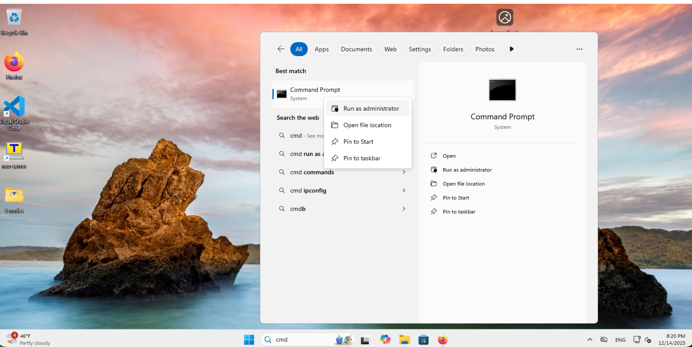{ style="width:100%" }

下記にはYesと回答します。

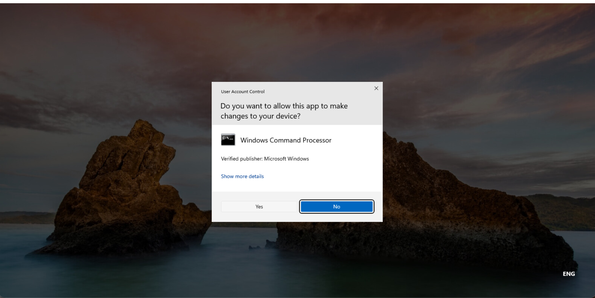{ style="width:100%" }

‘route print’ で198.18.11.0/24, 198.18.12.0/24のルートがないことを確認します。

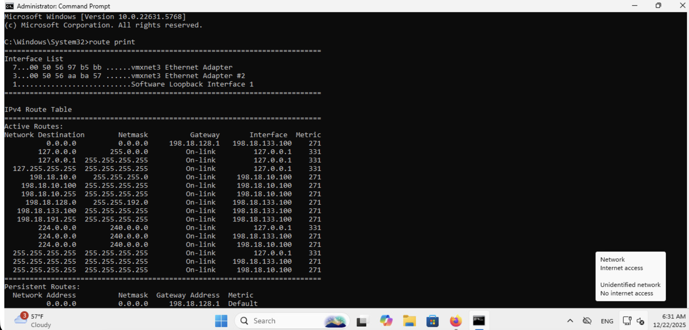{ style="width:100%" }

現時点では、198.18.11.27/24, 198.18.12.27/24いずれにもpingは飛びません。

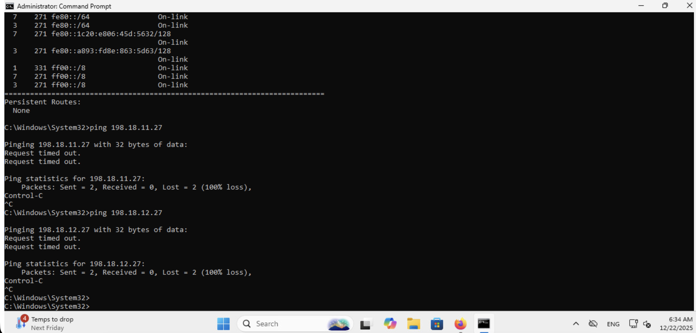{ style="width:100%" }

下記コマンドにてRemote CE向けのルートを追加します。

```text
route add 198.18.11.0 mask 255.255.255.0 198.18.10.51
route add 198.18.12.0 mask 255.255.255.0 198.18.10.51
```

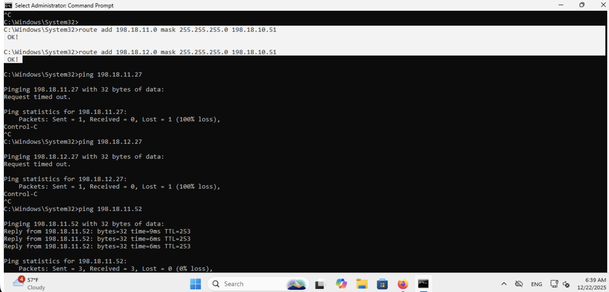{ style="width:100%" }

Ubuntu 側にルート設定をしていないため、Remote PEに対してはPingが飛びますが、Remote CEに対してはPingが返ってこないことがわかります。

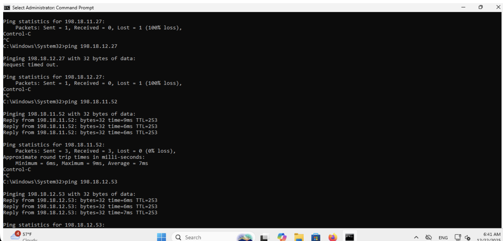{ style="width:100%" }

そこで次にUbuntu側にルート設定を行います。dCloud Session View 画面に戻り、Ubuntuを選択し、VM Consoleをクリックします。

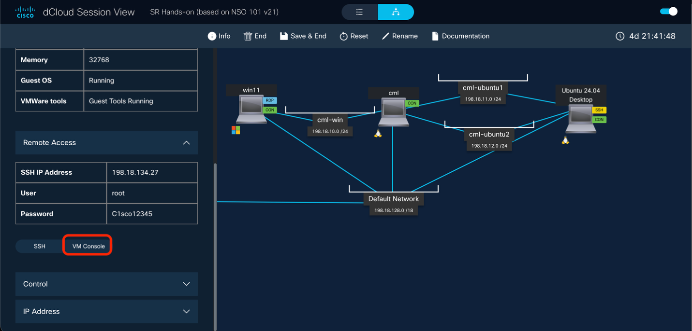{ style="width:100%" }

下のメニューからTerminalを選択し、’ip route’ でUbuntuが持つ経路情報を確認します。

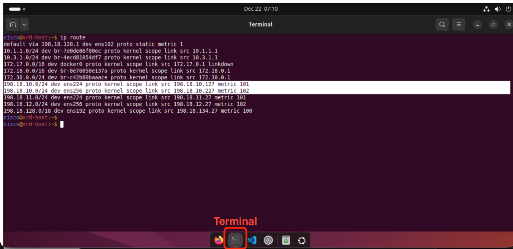{ style="width:100%" }

次のL2VPNのシナリオ用に198.18.10.0/24のアドレスがUbuntuにも設定されているため、ハイライトされた経路が表示されていますが、リモートのWindowsに到達するための経路は設定されていないことがわかります。

そこで下記のコマンドにてWindows向けの経路を追加します。
バックスラッシュが入力できない場合は、一行で入力してください。

```text
sudo ip route add 198.18.10.0/24 \
nexthop via 198.18.11.52 weight 1 \
nexthop via 198.18.12.53 weight 1
```

Password: <strong>講師よりお伝えします</strong>

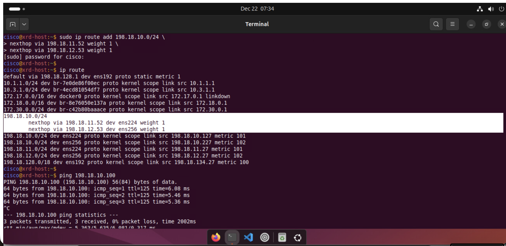{ style="width:100%" }

上記のようにECMP経路が追加され、Windows (198.19.10.100) 向けのPingも通るようになったことがわかります。

Windows に戻り、Ubuntu  (198.18.11.27, 198.18.12.27) 向けのPingを実施します。

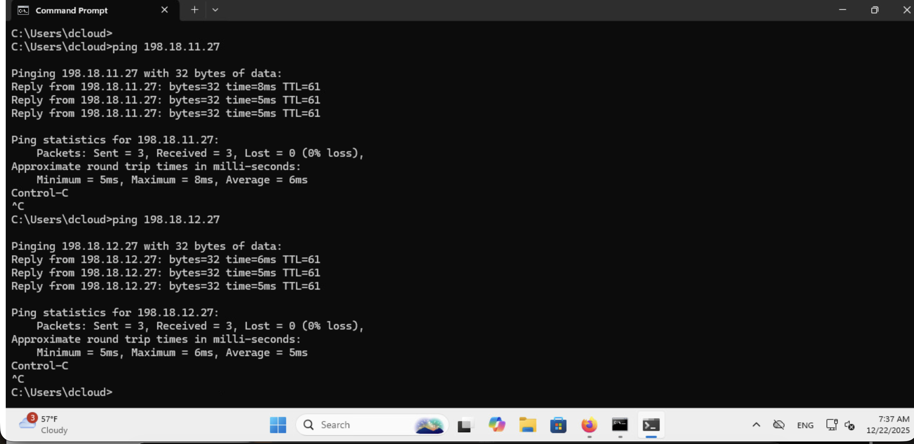{ style="width:100%" }

また、Windows から Ubuntu (198.18.11.27, 198.18.12.27) にSSH を実施すると下記のようにログインできることがわかります。

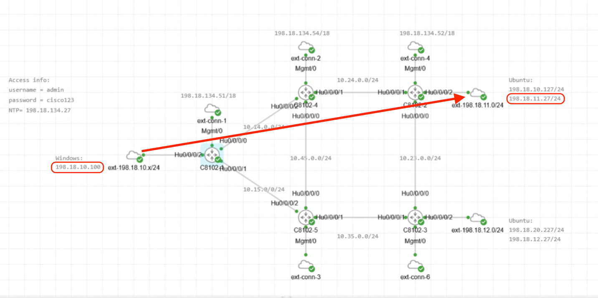{ style="width:100%" }

{ style="width:100%" }

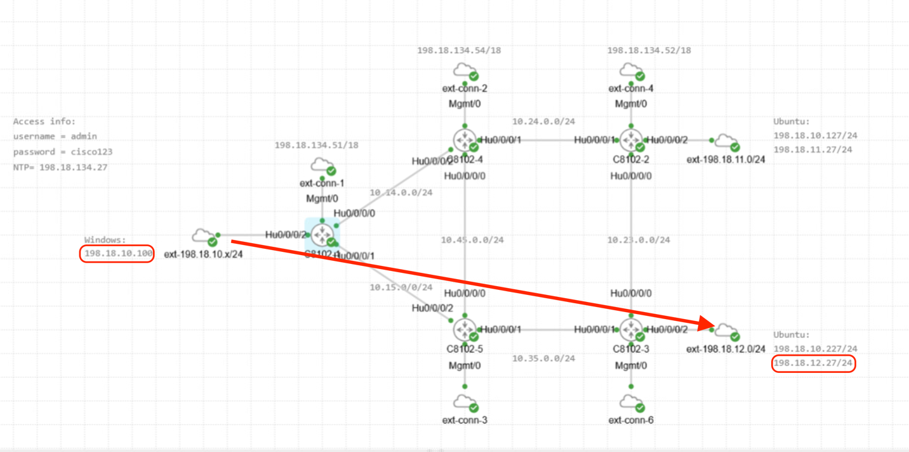{ style="width:100%" }

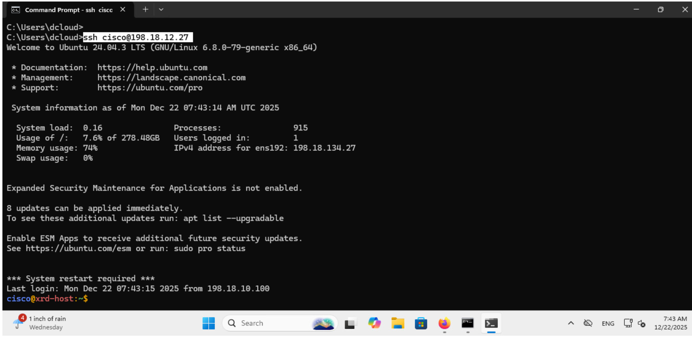{ style="width:100%" }

## 2.5 VPN トラフィック確認

!!! abstract "ゴール"

    VPNトラフィックがSRネットワーク上をどのように流れているかを確認すること

Windows から Ubuntu に対して継続的にPingを打ち続けます。

```text
ping -t 198.18.11.27
```

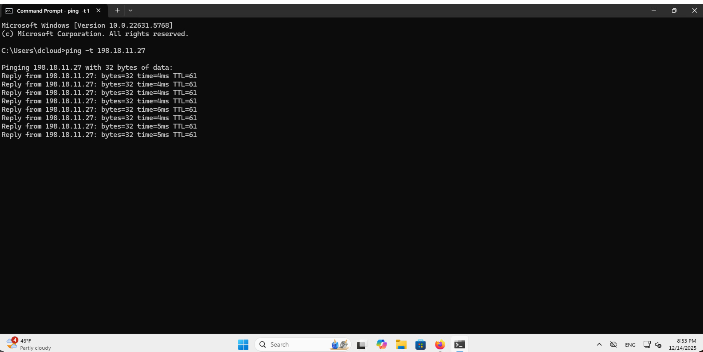{ style="width:100%" }

C8102-1のWindows側インタフェースにて下記のようにInput/Outputトラフィックの変化をモニターできます。（オプション）Ctrl+Cで止めます。

<pre class="cli"><code>RP/0/RP0/CPU0:c8102-1#<strong>monitor interface HundredGigE 0/0/0/2</strong>
HundredGigE0/0/0/2 is up, line protocol is up
Encapsulation ARPA

Traffic Stats:(2 second rates)                                     Delta
  Input  Packets:                      1696                            2
  Input  pps:                             1
  Input  Bytes:                      253648                          156
  Input  Kbps (rate):                     0                       (  0%)
  Output Packets:                       471                            2
  Output pps:                             1
  Output Bytes:                       57594                          156
  Output Kbps (rate):                     0                       (  0%)

Errors Stats:
  Input  Total:                           0                            0
  Input  CRC:                             0                            0
  Input  Frame:                           0                            0
  Input  Overrun:                         0                            0
  Output Total:                           0                            0
  Output Underrun:                        0                            0

Quit='q', Freeze='f', Thaw='t', Clear='c', Interface='i',
Next='n', Prev='p'

Brief='b', Detail='d', Protocol(IPv4/IPv6)='r'</code></pre>

CML にて、C8102-1とC8102-４の間のリンクを右クリックし、Packet Captureを選択します。

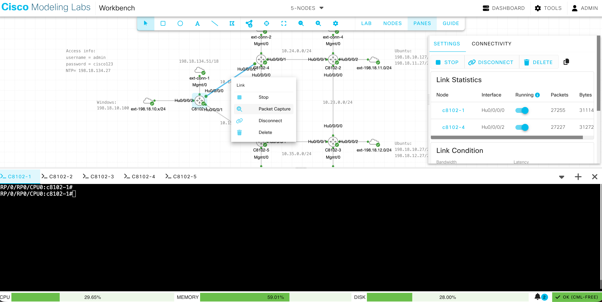{ style="width:100%" }

Start をクリックするとパケットキャプチャを開始します。Stop で停止します。

Source: 198.18.10.100, Destination: 198.18.11.27, Protocol: ICMP のパケットをクリックすると、詳細が表示されます。C8201-1からC8201-4へLabel: 24002 と 16002 が付与された上で転送されていることがわかります。

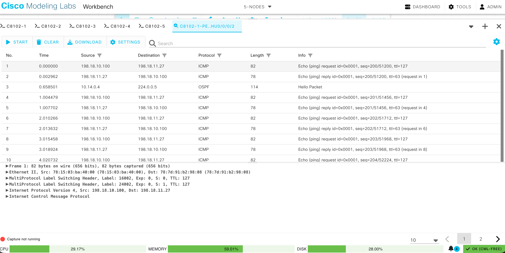{ style="width:100%" }

次に、C8201-4からC8201-2間のリンクを右クリックし、Packet Captureを選択します。

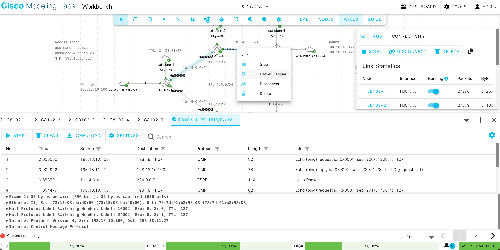{ style="width:100%" }

Start でパケットキャプチャを開始し、Source: 198.18.10.100, Destination: 198.18.11.27, Protocol: ICMP のパケットをクリックします。PHPがデフォルトで有効になっているため、宛先の一つ手前でTransport Label (16002) が外されて、C8201-4からC8201-2へ転送されていることがわかります。

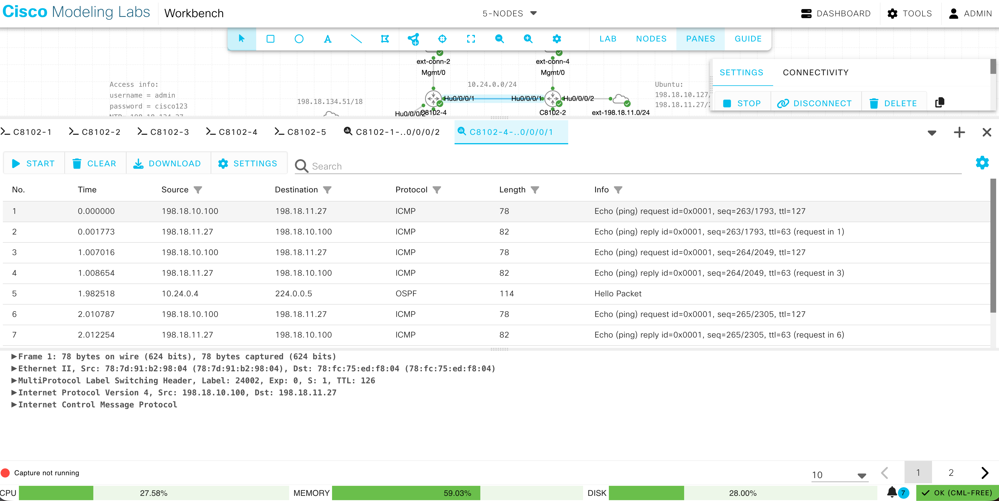{ style="width:100%" }

Windows にてCtrl＋CでPingを止めます。

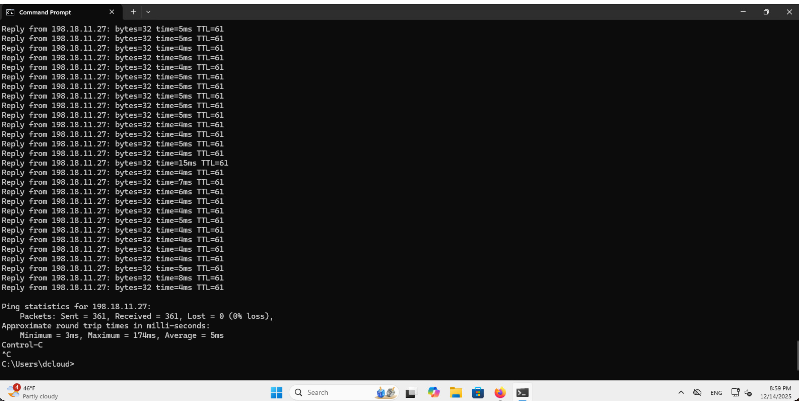{ style="width:100%" }

時間に余裕がありましたら、WindowsからC8102-3に接続する198.18.12.27向けにPingを実施して、パケットキャプチャを実施してみてください。行きは、IGP最短パスのため、C8201-1→C8201-5→C8201-3という経路を通ります。

- ラボの制約上、C8201-2とC8201-3は同じUbuntuに接続しています。そのため、戻りはECMPとなり、経路は固定ではありません。
