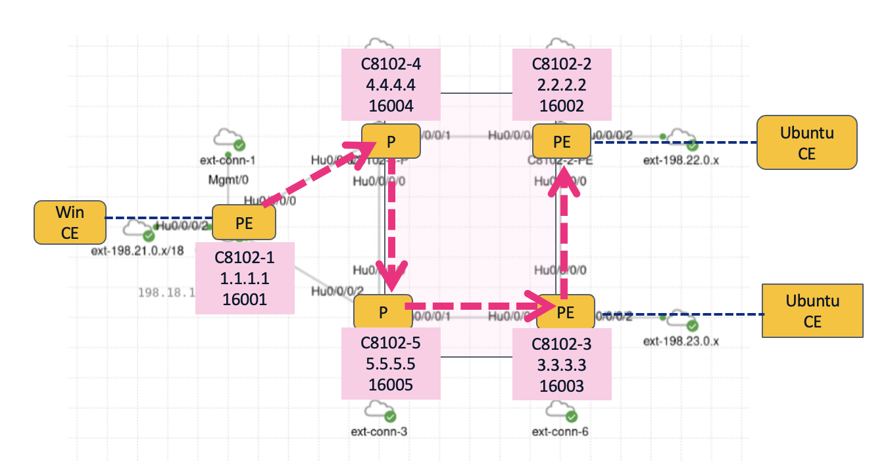
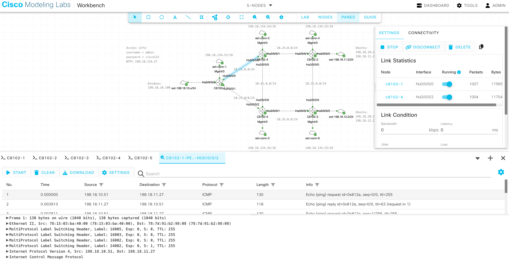
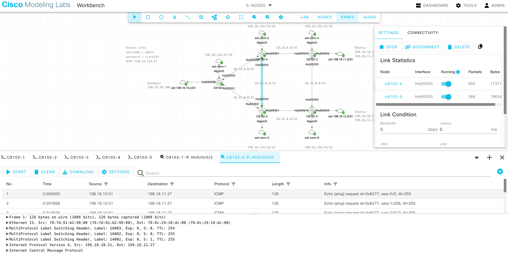
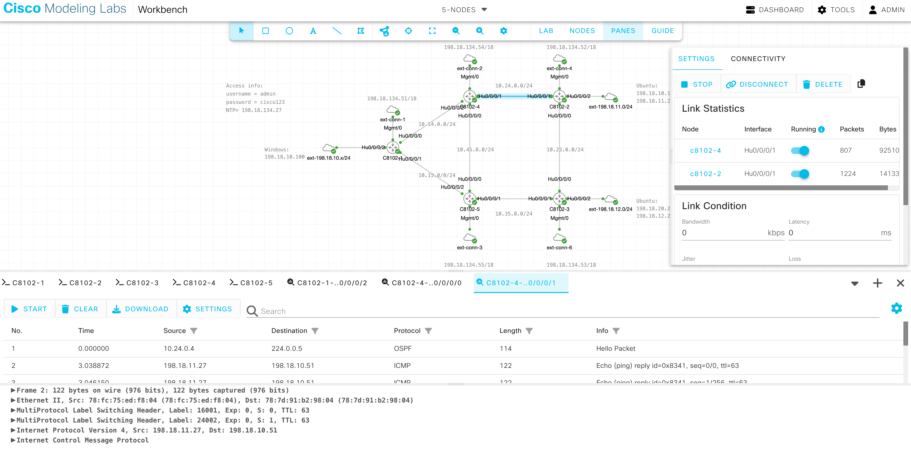

# 03. SR-TE Explicit Path

## 3.1 SR-TE DB設定

!!! abstract "ゴール"

    ヘッドエンドがパス計算を行うためのSR-TE DBの構築

今回は、C8102-1からC8102-2向けのトラフィックが下記のような経路を通るようにExplicit Pathを設定します。

{ style="width:100%" }

ヘッドエンドではパス計算を行うため SR-TE DB を利用します。デフォルトでは、下記のようにSR-TE DBには何もデータが存在しません。

<pre class="cli"><code>RP/0/RP0/CPU0:c8102-1#<strong>show segment-routing traffic-eng topology</strong>
Thu Dec 25 05:25:50.603 UTC
RP/0/RP0/CPU0:c8102-1#</code></pre>

今回ヘッドエンドとなるC8102-1にて下記のように設定し、OSPF のリンクステートデータベース (LSDB) がSR-TE DB にフィードされるようにします。

<pre class="cli"><code>router ospf core
 distribute link-state
!</code></pre>

設定後、再度SR-TE DBを表示すると、下記のようにSR-TEパス計算に必要なトポロジーデータベースが確認できるようになったことがわかります。

<pre class="cli"><code>RP/0/RP0/CPU0:c8102-1#<strong>show segment-routing traffic-eng topology</strong>
Thu Dec 25 05:27:11.603 UTC

Topology database:
------------------
Node 1
  Router ID: 1.1.1.1
  Num Anycast Prefixes: 0
  OSPF 1.1.1.1 (area: 0)
    Hostname: c8102-1
    TE router ID: 1.1.1.1
    SRGBs: 16000 - 24000

    Prefixes:
      1.1.1.1/32
        Regular SID index: 1
      10.14.0.0/24
      10.15.0.0/24

    Links:
      Local: 10.14.0.1 Remote: 10.14.0.4
        Remote node: OSPF 4.4.4.4 (area: 0)
          Hostname: c8102-4
          TE router ID: 4.4.4.4
        Metrics: IGP 1, TE 1
        Bandwidth: Total 12499999744 Bps, Reservable 0 Bps
        Adj-SIDs: 24000 (unprotected)

      Local: 10.15.0.1 Remote: 10.15.0.5
        Remote node: OSPF 5.5.5.5 (area: 0)
          Hostname: c8102-5
          TE router ID: 5.5.5.5
        Metrics: IGP 1, TE 1
        Bandwidth: Total 12499999744 Bps, Reservable 0 Bps
        Adj-SIDs: 24001 (unprotected)

Node 4
  Router ID: 2.2.2.2
  Num Anycast Prefixes: 0
  OSPF 2.2.2.2 (area: 0)
&lt; --- omitted --- &gt;</code></pre>

## 3.2 Explicit Path 設定

!!! abstract "ゴール"

    C8102-1からC8102-2向けのExplicit-Pathの設定

C8102-1からC8102-2向けのトラフィックが下記のような経路を通るようにSIDリストを作成し、Explicit Pathを設定します。

{ style="width:100%" }

ヘッドエンドとなるC8102-1に下記のように設定を行います。

<pre class="cli"><code>segment-routing
 traffic-eng
  segment-list SIDLIST1
   index 10 mpls label 16004
   index 20 mpls label 16005
   index 30 mpls label 16003
   index 40 mpls label 16002
  !
  policy POLICY1
   color 10 end-point ipv4 2.2.2.2
   candidate-paths
    preference 100
     explicit segment-list SIDLIST1
     !
    !
   !
  !
 !
!</code></pre>

SRポリシーの状態を確認し、Operational StateがUpしていることを確認します。

また、Binding SIDも確認できます。

<pre class="cli"><code>RP/0/RP0/CPU0:c8102-1#<strong>show segment-routing traffic-eng policy detail</strong>
Thu Dec 25 05:41:41.478 UTC

SR-TE policy database
---------------------

<mark>Color: 10, End-point: 2.2.2.2</mark>
  Name: srte_c_10_ep_2.2.2.2
  Status:
    <mark>Admin: up  Operational: up</mark> for 00:00:15 (since Dec 25 05:41:26.251)
  Candidate-paths:
    Preference: 100 (configuration) (active)
      Name: POLICY1
      Requested BSID: dynamic
      Constraints:
        Protection Type: protected-preferred
        Maximum SID Depth: 8 
      Performance-measurement:
        Reverse-path segment-list: 
        Delay-measurement: Disabled
        Liveness-detection: Disabled
      <mark>Explicit: segment-list SIDLIST1 (valid)</mark>
        Weight: 1, Metric Type: TE
          <mark>SID[0]: 16004</mark> [Prefix-SID, 4.4.4.4]
          <mark>SID[1]: 16005</mark>
          <mark>SID[2]: 16003</mark>
          <mark>SID[3]: 16002</mark>
  LSPs:
    LSP[0]:
      LSP-ID: 2 policy ID: 1 (active)
      Local label: 24003
      State: Programmed
      Binding SID: 24004
  Attributes:
    <mark>Binding SID: 24004</mark>
    Forward Class: Not Configured
    Steering labeled-services disabled: no
    Steering BGP disabled: no
    IPv6 caps enable: yes
    Invalidation drop enabled: no
    Max Install Standby Candidate Paths: 0
    Path Type: SRMPLSv4

RP/0/RP0/CPU0:c8102-1#</code></pre>

LFIBテーブルでも、Binding SIDを確認することができます。

<pre class="cli"><code>RP/0/RP0/CPU0:c8102-1#<strong>show mpls forwarding</strong>
Thu Dec 25 05:45:25.311 UTC
Local  Outgoing    Prefix             Outgoing     Next Hop        Bytes       
Label  Label       or ID              Interface                    Switched    
------ ----------- ------------------ ------------ --------------- ------------
16002  16002       SR Pfx (idx 2)     Hu0/0/0/0    10.14.0.4       587944      
16003  16003       SR Pfx (idx 3)     Hu0/0/0/1    10.15.0.5       175360      
16004  Pop         SR Pfx (idx 4)     Hu0/0/0/0    10.14.0.4       0           
16005  Pop         SR Pfx (idx 5)     Hu0/0/0/1    10.15.0.5       0           
24000  Pop         SR Adj (idx 0)     Hu0/0/0/0    10.14.0.4       0           
24001  Pop         SR Adj (idx 0)     Hu0/0/0/1    10.15.0.5       0           
24003  16005       SR TE: 1 [TE-INT]  Hu0/0/0/0    10.14.0.4       0           
<mark>24004  Pop         No ID              srte_c_10_ep point2point     0</mark>           
RP/0/RP0/CPU0:c8102-1#</code></pre>

ここで、全ルータにmpls oamを設定し、LSP ping/tracerouteを有効にします。

<pre class="cli"><code>mpls oam</code></pre>

SRポリシーを指定してTracerouteを実施すると、下記のようにラベル転送の様子を確認することができます。

<pre class="cli"><code>RP/0/RP0/CPU0:c8102-1#<strong>traceroute sr-mpls policy name srte_c_10_ep_2.2.2.2 lsp-end-point 2.2.2.2</strong>
Thu Dec 25 05:57:21.357 UTC

Tracing MPLS Label Switched Path over SR Policy with name [srte_c_10_ep_2.2.2.2], timeout is 2 seconds

Codes: '!' - success, 'Q' - request not sent, '.' - timeout,
  'L' - labeled output interface, 'B' - unlabeled output interface, 
  'D' - DS Map mismatch, 'F' - no FEC mapping, 'f' - FEC mismatch,
  'M' - malformed request, 'm' - unsupported tlvs, 'N' - no rx label, 
  'P' - no rx intf label prot, 'p' - premature termination of LSP, 
  'R' - transit router, 'I' - unknown upstream index,
  'X' - unknown return code, 'x' - return code 0

Type escape sequence to abort.

  <mark>0 10.14.0.1 MRU 1500 [Labels: 16005/16003/16002 Exp: 0/0/0]</mark>
<mark>L 1 10.14.0.4 MRU 1500 [Labels: implicit-null/16003/16002 Exp: 0/0/0] 40 ms</mark>
<mark>L 2 10.45.0.5 MRU 1500 [Labels: implicit-null/16002 Exp: 0/0] 18 ms</mark>
<mark>L 3 10.35.0.3 MRU 1500 [Labels: implicit-null Exp: 0] 16 ms</mark>
<mark>! 4 10.23.0.2 19 ms</mark>
RP/0/RP0/CPU0:c8102-1#</code></pre>

## 3.3 Automated Steering 設定

!!! abstract "ゴール"

    C8102-1からC8102-2向けのVPNトラフィックがSRポリシーに従って転送されるようにすること

現在、C8102-2（2.2.2.2）向けのVPNトラフィックの経路はSRポリシーに載っていないことを確認します。

<pre class="cli"><code>RP/0/RP0/CPU0:c8102-1#<strong>traceroute 198.18.11.27 vrf CustA source HundredGigE 0/0/0/2</strong>
Tue Jan  6 03:04:43.701 UTC

Type escape sequence to abort.
Tracing the route to 198.18.11.27

 1  10.14.0.4 <mark>[MPLS: Labels 16002/24002 Exp 0]</mark> 9 msec  9 msec  7 msec 
 2  10.24.0.2 5 msec  5 msec  5 msec 
 3  198.18.11.27 5 msec  5 msec  5 msec 
RP/0/RP0/CPU0:c8102-1#
RP/0/RP0/CPU0:c8102-1#<strong>show cef vrf CustA 198.18.11.27 </strong>
Tue Jan  6 03:07:53.038 UTC
198.18.11.0/24, version 8, internal 0x5000001 0x30 (ptr 0x9c29e0a8) [1], 0x0 (0x0), 0x208 (0x9d03e638)
 Updated Jan  6 02:36:10.226
 Prefix Len 24, traffic index 0, precedence n/a, priority 3
  gateway array (0x9bbfcf98) reference count 1, flags 0x2038, source rib (7), 0 backups
                [1 type 1 flags 0x48441 (0x9d088ba8) ext 0x0 (0x0)]
  LW-LDI[type=0, refc=0, ptr=0x0, sh-ldi=0x0]
  gateway array update type-time 1 Jan  6 02:36:10.227
 LDI Update time Jan  6 02:36:10.227
   via 2.2.2.2/32, 3 dependencies, recursive [flags 0x6000]
    path-idx 0 NHID 0x0 [0x9d1370a8 0x0]
    recursion-via-/32
    next hop VRF - 'default', table - 0xe0000000
    <mark>next hop 2.2.2.2/32 via 16002/0/21</mark>
     <mark>next hop 10.14.0.4/32 Hu0/0/0/0    labels imposed {16002 24002}</mark>

    Load distribution: 0 (refcount 1)

    Hash  OK  Interface                 Address
    <mark>0     Y   recursive                 16002/0</mark>        
RP/0/RP0/CPU0:c8102-1#</code></pre>

SRポリシーのエンドポイントである<strong>C8102-2</strong>にて、Color, Route-Policy を設定し BGP に適用します。下記の設定では、C8102-2からC8102-1向けにBGPで広報されるすべてのVPNv4ルートに対して、Color:10 が付加されます。

<pre class="cli"><code>extcommunity-set opaque PINK
  10
end-set
!
route-policy SET_COLOR
  set extcommunity color PINK
end-policy
!
router bgp 65000
 neighbor-group PEs
  address-family vpnv4 unicast
   route-policy SET_COLOR out
  !
 !</code></pre>

C8102-1にて、show bgp vrfで確認すると、C8102-2から広報されたリモートCEのプレフィックス198.18.11.27 には、BGP color extended community 10 が付加されており、Color 10 、 Binding SID 24004の SR ポリシーに関連付けられていることがわかります。

<pre class="cli"><code>RP/0/RP0/CPU0:c8102-1#<strong>show bgp vrf CustA 198.18.11.27 </strong>
Tue Jan  6 03:38:10.327 UTC
BGP routing table entry for 198.18.11.0/24, Route Distinguisher: 1.1.1.1:65000
Versions:
  Process           bRIB/RIB   SendTblVer
  Speaker                 18           18
Last Modified: Jan  6 03:32:46.742 for 00:05:23
Paths: (1 available, best #1)
  Not advertised to any peer
  Path #1: Received by speaker 0
  Not advertised to any peer
  Local
    2.2.2.2 C:10 (bsid:24004) (metric 3) from 2.2.2.2 (2.2.2.2)
      Received Label 24002 
      Origin incomplete, metric 0, localpref 100, valid, internal, best, group-best, import-candidate, imported
      Received Path ID 0, Local Path ID 1, version 18
      <mark>Extended community: Color:10</mark> RT:100:100 
      <mark>SR policy color 10, up, not-registered, bsid 24004</mark>

      Source AFI: VPNv4 Unicast, Source VRF: default, Source Route Distinguisher: 2.2.2.2:65000
RP/0/RP0/CPU0:c8102-1#
RP/0/RP0/CPU0:c8102-1#<strong>show bgp vrf CustA ipv4 unicast </strong>
Tue Jan  6 03:41:34.146 UTC
BGP VRF CustA, state: Active
BGP Route Distinguisher: 1.1.1.1:65000
VRF ID: 0x60000001
BGP router identifier 1.1.1.1, local AS number 65000
Non-stop routing is enabled
BGP table state: Active
Table ID: 0xe0000001   RD version: 18
BGP table nexthop route policy: 
BGP main routing table version 18
BGP NSR Initial initsync version 3 (Reached)
BGP NSR/ISSU Sync-Group versions 0/0

Status codes: s suppressed, d damped, h history, * valid, &gt; best
              i - internal, r RIB-failure, S stale, N Nexthop-discard
Origin codes: i - IGP, e - EGP, ? - incomplete
   Network            Next Hop            Metric LocPrf Weight Path
Route Distinguisher: 1.1.1.1:65000 (default for vrf CustA)
Route Distinguisher Version: 18
*&gt; 198.18.10.0/24     0.0.0.0                  0         32768 ?
<mark>*&gt;i198.18.11.0/24     2.2.2.2 C:10             0    100      0 ?</mark>
*&gt;i198.18.12.0/24     3.3.3.3                  0    100      0 ?

Processed 3 prefixes, 3 paths
RP/0/RP0/CPU0:c8102-1#</code></pre>

これにより、SRポリシーのColorと一致する宛先向けのトラフィックはSRポリシーのパスにて転送されるようになります。

<pre class="cli"><code>RP/0/RP0/CPU0:c8102-1#<strong>traceroute 198.18.11.27 vrf CustA source HundredGigE 0/0/0/2</strong>
Tue Jan  6 03:43:09.204 UTC

Type escape sequence to abort.
Tracing the route to 198.18.11.27

 <mark>1  10.14.0.4 [MPLS: Labels 16005/16003/16002/24002 Exp 0] 11 msec  8 msec  8 msec </mark>
<mark> 2  10.45.0.5 [MPLS: Labels 16003/16002/24002 Exp 0] 8 msec  8 msec  8 msec </mark>
<mark> 3  10.35.0.3 [MPLS: Labels 16002/24002 Exp 0] 8 msec  8 msec  9 msec</mark> 
 4  10.23.0.2 7 msec  7 msec  8 msec 
 5  198.18.11.27 8 msec  5 msec  5 msec 
RP/0/RP0/CPU0:c8102-1#
RP/0/RP0/CPU0:c8102-1#<strong>show cef vrf CustA 198.18.11.27 </strong>
Tue Jan  6 03:43:53.956 UTC
198.18.11.0/24, version 14, internal 0x5000001 0x30 (ptr 0x9c29e0a8) [1], 0x0 (0x0), 0x208 (0x9d03e7a0)
 Updated Jan  6 03:32:46.398
 Prefix Len 24, traffic index 0, precedence n/a, priority 3
  gateway array (0x9bbffa98) reference count 1, flags 0x2038, source rib (7), 0 backups
                [1 type 1 flags 0x48441 (0x9d08b388) ext 0x0 (0x0)]
  LW-LDI[type=0, refc=0, ptr=0x0, sh-ldi=0x0]
  gateway array update type-time 1 Jan  6 03:32:46.395
 LDI Update time Jan  6 03:32:46.395
   via local-label 24004, 3 dependencies, recursive [flags 0x6000]
    path-idx 0 NHID 0x0 [0x9d1379a8 0x0]
    recursion-via-label
    next hop VRF - 'default', table - 0xe0000000
    next hop via 24004/0/21
     labels imposed {24002}

    Load distribution: 0 (refcount 1)

    Hash  OK  Interface                 Address
    <mark>0     Y   recursive                 24004/0</mark>        
RP/0/RP0/CPU0:c8102-1#</code></pre>

## 3.4 パケットキャプチャ

!!! abstract "ゴール"

    C8102-1からC8102-2向けのトラフィックのラベル転送をキャプチャする

設定したSRポリシーパスが通るリンク（ピンク）でパケットキャプチャを開始します。

{ style="width:100%" }

そして、C8102-1にて198.18.11.27向けにPingを行います。

<pre class="cli"><code>RP/0/RP0/CPU0:c8102-1#<strong>ping vrf CustA 198.18.11.27 count 100</strong>
Tue Jan  6 03:51:23.311 UTC
Type escape sequence to abort.
Sending 100, 100-byte ICMP Echos to 198.18.11.27 timeout is 2 seconds:
!!!!!!!!!!!!!!!!!!!!!!!!!!!!!!!!!!!!!!!!!!!!!!!!!!!!!!!!!!!!!!!!!!!!!!
!!!!!!!!!!!!!!!!!!!!!!!!!!!!!!
Success rate is 100 percent (100/100), round-trip min/avg/max = 3/6/10 ms
RP/0/RP0/CPU0:c8102-1#</code></pre>

例えば、C8102-1からC8201-4の間のパケットキャプチャを確認すると、C8102-1からのICMP requestにてSRポリシーに従ったラベルが付与されて転送されていることがわかります。

{ style="width:100%" }

C8102-4からC8102-5の間でも同様にラベルスタックを確認できます。

{ style="width:100%" }

一方、C8102-2からのICMP replyに関しては、SRポリシーがC8102-2には設定されていないため、IGP最短パスで転送されます。

例えば、C8102-4とC8102-2の間でパケットキャプチャをすると、下記のようにICMP replyはC8102-1のNode SID (16001) とVPNラベル (24002) のみ付加して転送していることがわかります。

{ style="width:100%" }

## 3.5 設定削除

!!! abstract "ゴール"

    次のシナリオのために設定を削除します。

C8102-1にて下記のようにSRポリシーをします。

<pre class="cli"><code>segment-routing
 no traffic-eng
!</code></pre>
