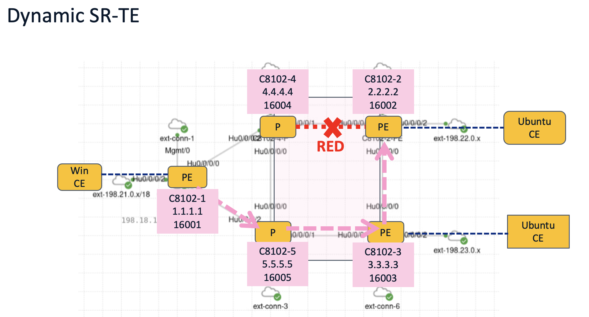
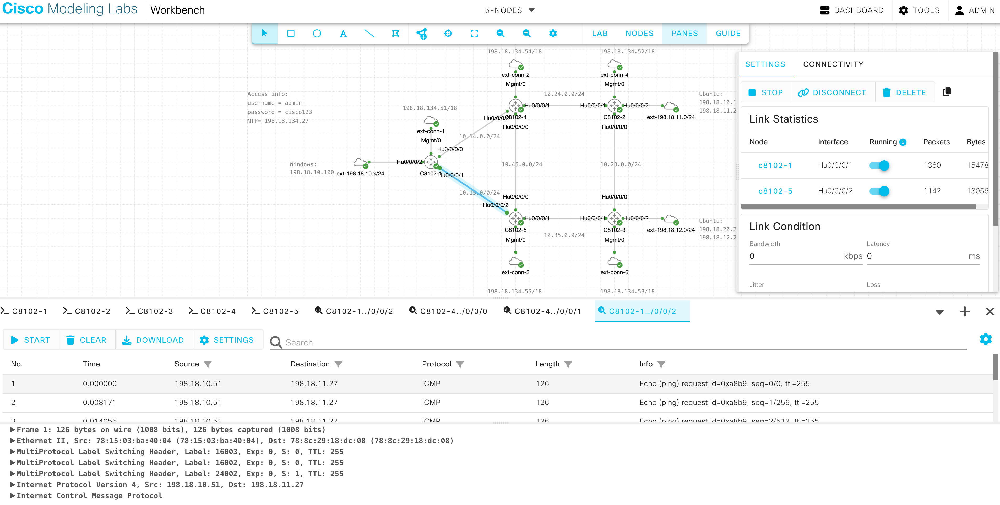
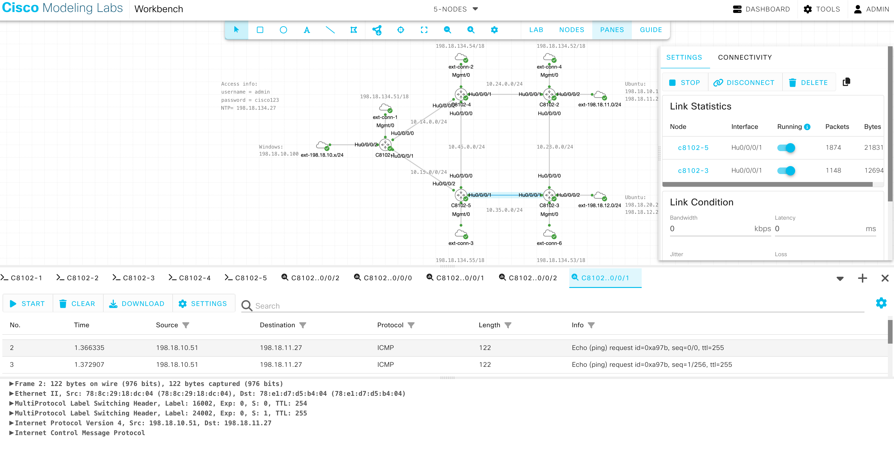
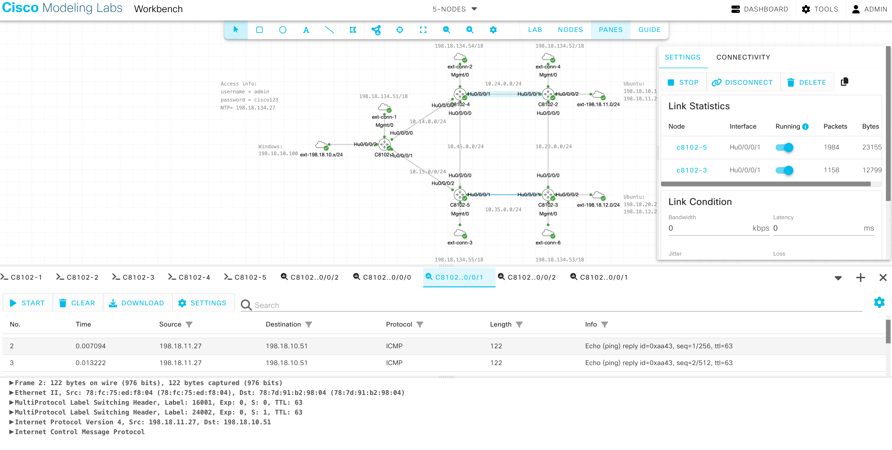

# 04. SR-TE Dynamic Path

## 4.1 TE Affinity設定

!!! abstract "ゴール"

    特定のリンクにColorを付けること

今回は、C8102-4とC8102-2の間のリンクにColor: REDを設定し、C8102-1からC8102-2向けにREDのリンクを避けるようなパスを計算するDynamic Pathを設定します。

{ style="width:100%" }

まず、REDリンクの両端であるC8102-2とC8102-4にTE Affinityの設定を行います。

<pre class="cli"><code>segment-routing
 traffic-eng
  interface HundredGigE0/0/0/1
   affinity
    name RED
   !
  !
  affinity-map
   name RED bit-position 3
  !
 !
!</code></pre>

また、ヘッドエンドであるC8102-1にもColor REDのbit-positionを設定します。

<pre class="cli"><code>segment-routing
 traffic-eng
  affinity-map
   name RED bit-position 3
  !
 !
!</code></pre>

C8102-1にてSR-TE DBを確認すると、下記のようにC8102-2とC8102-4の間のリンクにColor REDであることを示すAdmin groups: 0x00000008 (bit-position 3) が表示されていることがわかります。（下記の表示は出力の一部のみ表示しております。）

<pre class="cli"><code>RP/0/RP0/CPU0:c8102-1#<strong>show segment-routing traffic-eng topology </strong>
Thu Dec 25 07:15:42.738 UTC

Topology database:
------------------
&lt; --- omitted --- &gt;

Node 4
  Router ID: 2.2.2.2
  Num Anycast Prefixes: 0
  OSPF 2.2.2.2 (area: 0)
    Hostname: c8102-2
    TE router ID: 2.2.2.2
    SRGBs: 16000 - 24000
    SRLBs: 15000 - 16000

    Prefixes:
      2.2.2.2/32
        Regular SID index: 2
      10.23.0.0/24
      10.24.0.0/24

    Links:
      Local: 10.23.0.2 Remote: 10.23.0.3
        Remote node: OSPF 3.3.3.3 (area: 0)
          Hostname: c8102-3
          TE router ID: 3.3.3.3
        Metrics: IGP 1, TE 1
        Bandwidth: Total 12499999744 Bps, Reservable 0 Bps
        Adj-SIDs: 24000 (unprotected)

      <mark>Local: 10.24.0.2 Remote: 10.24.0.4</mark>
        Remote node: OSPF 4.4.4.4 (area: 0)
          Hostname: c8102-4
          TE router ID: 4.4.4.4
        Metrics: IGP 1, TE 1
        Bandwidth: Total 12499999744 Bps, Reservable 0 Bps
        <mark>Admin groups: 0x00000008</mark> 0x00000000 0x00000000 0x00000000
                      0x00000000 0x00000000 0x00000000 0x00000000
        Adj-SIDs: 24001 (unprotected)

&lt; --- omitted --- &gt;

Node 2
  Router ID: 4.4.4.4
  Num Anycast Prefixes: 0
  OSPF 4.4.4.4 (area: 0)
    Hostname: c8102-4
    TE router ID: 4.4.4.4
    SRGBs: 16000 - 24000
    SRLBs: 15000 - 16000

    Prefixes:
      4.4.4.4/32
        Regular SID index: 4
      10.14.0.0/24
      10.24.0.0/24
      10.45.0.0/24
          
    Links:
      &lt; --- omitted --- .

      <mark>Local: 10.24.0.4 Remote: 10.24.0.2</mark>
        Remote node: OSPF 2.2.2.2 (area: 0)
          Hostname: c8102-2
          TE router ID: 2.2.2.2
        Metrics: IGP 1, TE 1
        Bandwidth: Total 12499999744 Bps, Reservable 0 Bps
        <mark>Admin groups: 0x00000008</mark> 0x00000000 0x00000000 0x00000000
                      0x00000000 0x00000000 0x00000000 0x00000000
        Adj-SIDs: 24001 (unprotected)

      Local: 10.45.0.4 Remote: 10.45.0.5
        Remote node: OSPF 5.5.5.5 (area: 0)
          Hostname: c8102-5
          TE router ID: 5.5.5.5
        Metrics: IGP 1, TE 1
        Bandwidth: Total 12499999744 Bps, Reservable 0 Bps
        Adj-SIDs: 24000 (unprotected)

Node 3
  Router ID: 5.5.5.5
  Num Anycast Prefixes: 0
  OSPF 5.5.5.5 (area: 0)
    Hostname: c8102-5
    TE router ID: 5.5.5.5
    SRGBs: 16000 - 24000

    Prefixes:
      5.5.5.5/32
        Regular SID index: 5
      10.15.0.0/24
      10.35.0.0/24
      10.45.0.0/24

    Links:
      Local: 10.15.0.5 Remote: 10.15.0.1
        Remote node: OSPF 1.1.1.1 (area: 0)
          Hostname: c8102-1
          TE router ID: 1.1.1.1
        Metrics: IGP 1, TE 1
        Bandwidth: Total 12499999744 Bps, Reservable 0 Bps
        Adj-SIDs: 24002 (unprotected)

      Local: 10.35.0.5 Remote: 10.35.0.3
        Remote node: OSPF 3.3.3.3 (area: 0)
          Hostname: c8102-3
          TE router ID: 3.3.3.3
        Metrics: IGP 1, TE 1
        Bandwidth: Total 12499999744 Bps, Reservable 0 Bps
        Adj-SIDs: 24001 (unprotected)

      Local: 10.45.0.5 Remote: 10.45.0.4
        Remote node: OSPF 4.4.4.4 (area: 0)
          Hostname: c8102-4
          TE router ID: 4.4.4.4
        Metrics: IGP 1, TE 1
        Bandwidth: Total 12499999744 Bps, Reservable 0 Bps
        Adj-SIDs: 24000 (unprotected)

RP/0/RP0/CPU0:c8102-1#</code></pre>

## 4.2 Dynamic Path 設定

!!! abstract "ゴール"

    C8102-1からC8102-2向けのDynamic-Pathの設定

{ style="width:100%" }

ヘッドエンドであるC8102-1にて、REDのリンクを避けるようなパスを計算するDynamic Pathを設定します。ここでは、Color のみを設定したODNポリシーを設定してみます。

<pre class="cli"><code>segment-routing
 traffic-eng
  on-demand color 10
   dynamic
    metric
     type igp
    !
    affinity
     exclude-any
      name RED
     !</code></pre>

SRポリシーの状態を確認し、Operational StateがUpしていることを確認します。ヘッドエンドにて計算されたSIDリスト及びBinding SIDも確認できます。

ODNポリシーは設定されたColorが付与されたルートを受信した時にNext HopをEndpointとするSRポリシーがインスタンス化されます。先ほど既にC8201-2にてColor:10でVPNv4ルートを広報しているため、今回はすぐにポリシーがアクティブになります。

<pre class="cli"><code>RP/0/RP0/CPU0:c8102-1#<strong>show segment-routing traffic-eng policy detail</strong>
Tue Jan  6 05:03:35.590 UTC

SR-TE policy database
---------------------

<mark>Color: 10, End-point: 2.2.2.2</mark>
  Name: srte_c_10_ep_2.2.2.2
  Status:
    <mark>Admin: up  Operational: up</mark> for 00:00:06 (since Jan  6 05:03:28.967)
  Candidate-paths:
    Preference: 200 (BGP ODN) (active)
      Requested BSID: dynamic
      Constraints:
        Protection Type: protected-preferred
        Affinity:
          exclude-any:
          RED
        Maximum SID Depth: 8 
      Performance-measurement:
        Reverse-path segment-list: 
        Delay-measurement: Disabled
        Liveness-detection: Disabled
      Dynamic (valid)
        Metric Type: IGP,   Path Accumulated Metric: 3 
          <mark>SID[0]: 16003 [Prefix-SID, 3.3.3.3]</mark>
          <mark>SID[1]: 16002 [Prefix-SID, 2.2.2.2]</mark>
    Preference: 100 (BGP ODN) (inactive)
      Requested BSID: dynamic
      PCC info:
        Symbolic name: bgp_c_10_ep_2.2.2.2_discr_100
        PLSP-ID: 1
      Constraints:
        Protection Type: protected-preferred
        <mark>Affinity:</mark>
<mark>          exclude-any:</mark>
<mark>          RED</mark>
        Maximum SID Depth: 8 
      Performance-measurement:
        Reverse-path segment-list: 
        Delay-measurement: Disabled
        Liveness-detection: Disabled
      Dynamic (pce) (inactive)
        Metric Type: NONE,   Path Accumulated Metric: 0 
  LSPs:
    LSP[0]:
      LSP-ID: 2 policy ID: 3 (active)
      Local label: 24004
      State: Programmed
      Binding SID: 24007
  Attributes:
    <mark>Binding SID: 24007</mark>
    Forward Class: Not Configured
    Steering labeled-services disabled: no
    Steering BGP disabled: no
    IPv6 caps enable: yes
    Invalidation drop enabled: no
    Max Install Standby Candidate Paths: 0
    Path Type: SRMPLSv4

RP/0/RP0/CPU0:c8102-1#</code></pre>

LFIBテーブルでも、Binding SIDを確認することができます。

<pre class="cli"><code>RP/0/RP0/CPU0:c8102-1#show mpls forwarding 
Tue Jan  6 05:10:36.799 UTC
Local  Outgoing    Prefix             Outgoing     Next Hop        Bytes       
Label  Label       or ID              Interface                    Switched    
------ ----------- ------------------ ------------ --------------- ------------
16002  16002       SR Pfx (idx 2)     Hu0/0/0/0    10.14.0.4       774         
16003  16003       SR Pfx (idx 3)     Hu0/0/0/1    10.15.0.5       516         
16004  Pop         SR Pfx (idx 4)     Hu0/0/0/0    10.14.0.4       0           
16005  Pop         SR Pfx (idx 5)     Hu0/0/0/1    10.15.0.5       0           
24000  Pop         SR Adj (idx 0)     Hu0/0/0/0    10.14.0.4       0           
24001  Pop         SR Adj (idx 0)     Hu0/0/0/1    10.15.0.5       0           
24003  Aggregate   CustA: Per-VRF Aggr[V]   \
                                      CustA                        0           
24004  16003       SR TE: 3 [TE-INT]  Hu0/0/0/1    10.15.0.5       0           
<mark>24007  Pop         No ID              srte_c_10_ep point2point     0</mark>           
RP/0/RP0/CPU0:c8102-1#</code></pre>

SRポリシーを指定してTracerouteを実施すると、REDリンクを避けてC8102-1 -&gt; C8102-5 -&gt; C8102-3 -&gt; C8102-2 というルートを通っていることがわかります。

<pre class="cli"><code>RP/0/RP0/CPU0:c8102-1#<strong>traceroute sr-mpls policy name srte_c_10_ep_2.2.2.2 lsp-end-point 2.2.2.2</strong>
Tue Jan  6 05:11:04.547 UTC

Tracing MPLS Label Switched Path over SR Policy with name [srte_c_10_ep_2.2.2.2], timeout is 2 seconds

Codes: '!' - success, 'Q' - request not sent, '.' - timeout,
  'L' - labeled output interface, 'B' - unlabeled output interface, 
  'D' - DS Map mismatch, 'F' - no FEC mapping, 'f' - FEC mismatch,
  'M' - malformed request, 'm' - unsupported tlvs, 'N' - no rx label, 
  'P' - no rx intf label prot, 'p' - premature termination of LSP, 
  'R' - transit router, 'I' - unknown upstream index,
  'X' - unknown return code, 'x' - return code 0

Type escape sequence to abort.

  <mark>0 10.15.0.1 MRU 1500 [Labels: 16003/16002 Exp: 0/0]</mark>
<mark>L 1 10.15.0.5 MRU 1500 [Labels: implicit-null/16002 Exp: 0/0] 14 ms</mark>
<mark>L 2 10.35.0.3 MRU 1500 [Labels: implicit-null Exp: 0] 11 ms</mark>
<mark>! 3 10.23.0.2 10 ms</mark>
RP/0/RP0/CPU0:c8102-1#</code></pre>

## 4.3 Automated Steering

!!! abstract "ゴール"

    C8102-1からC8102-2向けのVPNトラフィックがSRポリシーに従って転送されることを確認する

現在、SRポリシーのエンドポイントであるC8102-2からC8102-1向けにBGPで広報されるすべてのVPNv4ルートに対して、Color:10 を付加したままになっています。そのため、下記のように、C8102-2から広報されたリモートCEのプレフィックス198.18.11.27 向けのトラフィックはSRポリシーのパスにて転送されることがわかります。

<pre class="cli"><code>RP/0/RP0/CPU0:c8102-1#<strong>traceroute 198.18.11.27 vrf CustA source HundredGigE 0/0/0/2</strong>
Tue Jan  6 05:12:09.780 UTC

Type escape sequence to abort.
Tracing the route to 198.18.11.27

 <mark>1  10.15.0.5 [MPLS: Labels 16003/16002/24003 Exp 0] 9 msec  7 msec  7 msec </mark>
<mark> 2  10.35.0.3 [MPLS: Labels 16002/24003 Exp 0] 7 msec  7 msec  7 msec </mark>
<mark> 3  10.23.0.2 7 msec  7 msec  7 msec </mark>
<mark> 4  198.18.11.27 5 msec  5 msec  5 msec</mark> 
RP/0/RP0/CPU0:c8102-1#
RP/0/RP0/CPU0:c8102-1#<strong>show cef vrf CustA 198.18.11.27 </strong>
Tue Jan  6 05:12:30.790 UTC
198.18.11.0/24, version 6, internal 0x5000001 0x30 (ptr 0x9c29e0a8) [1], 0x0 (0x0), 0xa08 (0x9d03e638)
 Updated Jan  6 05:03:29.015
 Prefix Len 24, traffic index 0, precedence n/a, priority 3
  gateway array (0x9bbfdb98) reference count 1, flags 0x2038, source rib (7), 0 backups
                [1 type 1 flags 0x40441 (0x9d088ba8) ext 0x0 (0x0)]
  LW-LDI[type=0, refc=0, ptr=0x0, sh-ldi=0x0]
  gateway array update type-time 3 Jan  6 05:03:29.018
 LDI Update time Jan  6 05:03:29.018
   via local-label 24007, 3 dependencies, recursive [flags 0x6000]
    path-idx 0 NHID 0x0 [0x9d1374a8 0x0]
    recursion-via-label
    next hop VRF - 'default', table - 0xe0000000
    next hop via 24007/0/21
     labels imposed {24003}

    Load distribution: 0 (refcount 1)

    Hash  OK  Interface                 Address
    <mark>0     Y   recursive                 24007/0</mark>        
RP/0/RP0/CPU0:c8102-1#</code></pre>

## 4.4 パケットキャプチャ

!!! abstract "ゴール"

    C8102-1からC8102-2向けのトラフィックのラベル転送をキャプチャする

設定したSRポリシーパスが通るリンク（ピンク）でパケットキャプチャを開始します。

{ style="width:100%" }

そして、C8102-1にて198.18.11.27向けにPingを行います。

<pre class="cli"><code>RP/0/RP0/CPU0:c8102-1#<strong>ping vrf CustA 198.18.11.27 count 100</strong>         
Tue Jan  6 04:32:35.006 UTC
Type escape sequence to abort.
Sending 100, 100-byte ICMP Echos to 198.18.11.27 timeout is 2 seconds:
!!!!!!!!!!!!!!!!!!!!!!!!!!!!!!!!!!!!!!!!!!!!!!!!!!!!!!!!!!!!!!!!!!!!!!
!!!!!!!!!!!!!!!!!!!!!!!!!!!!!!
Success rate is 100 percent (100/100), round-trip min/avg/max = 3/5/10 ms
RP/0/RP0/CPU0:c8102-1#</code></pre>

例えば、C8102-1からC8201-5の間のパケットキャプチャを確認すると、C8102-1からのICMP requestにてSRポリシーに従ったラベルが付与されて転送されていることがわかります。

{ style="width:100%" }

C8102-５からC8102-３の間でも同様にラベルスタックを確認できます。

{ style="width:100%" }

一方、C8102-2からのICMP replyに関しては、SRポリシーがC8102-2には設定されていないため、IGP最短パスで転送されます。C8102-4とC8102-2の間でパケットキャプチャをすると、下記のようにICMP replyはC8102-1のNode SIDのみ付加して転送していることがわかります。

{ style="width:100%" }

## 4.5 設定削除

!!! abstract "ゴール"

    次のシナリオのために設定を削除します。

C8102-1にて下記のようにSRポリシーを削除します。

<pre class="cli"><code>segment-routing
 no traffic-eng
!</code></pre>

また、全てのPEにてCE向けインタフェース、VRF、BGP設定を削除します（C8102-1 ~ C8102-3）

<pre class="cli"><code>no interface HundredGigE0/0/0/2
no vrf CustA
no router bgp</code></pre>
