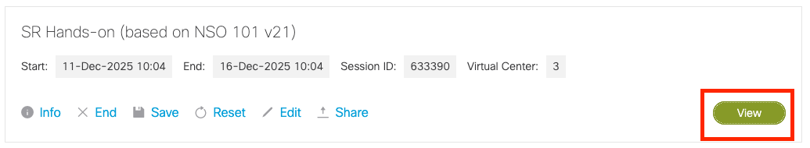
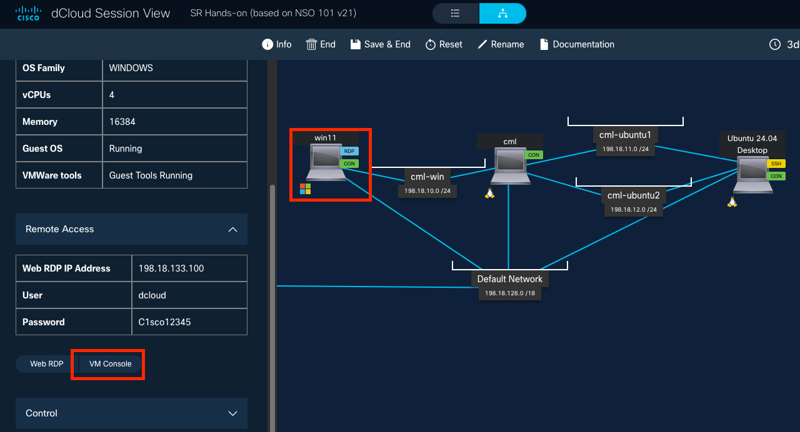
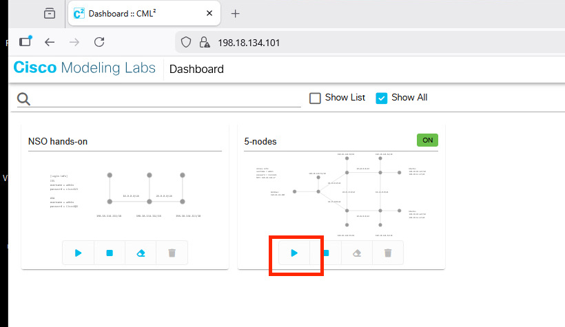
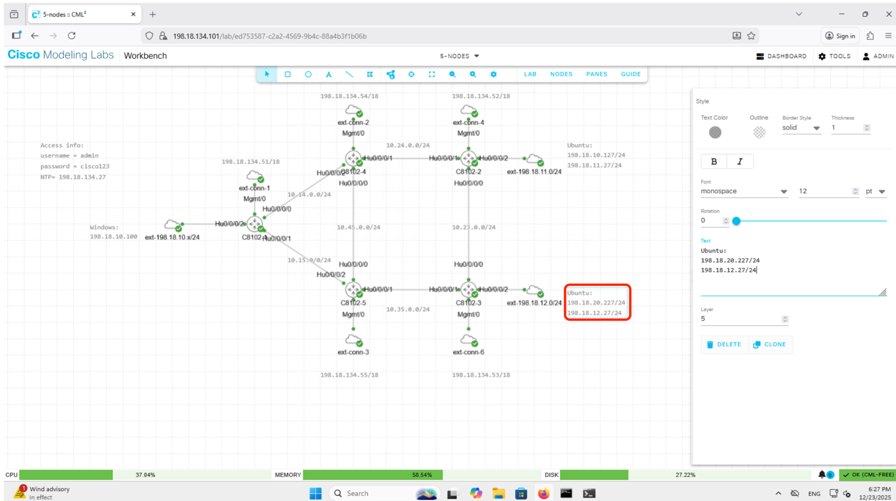
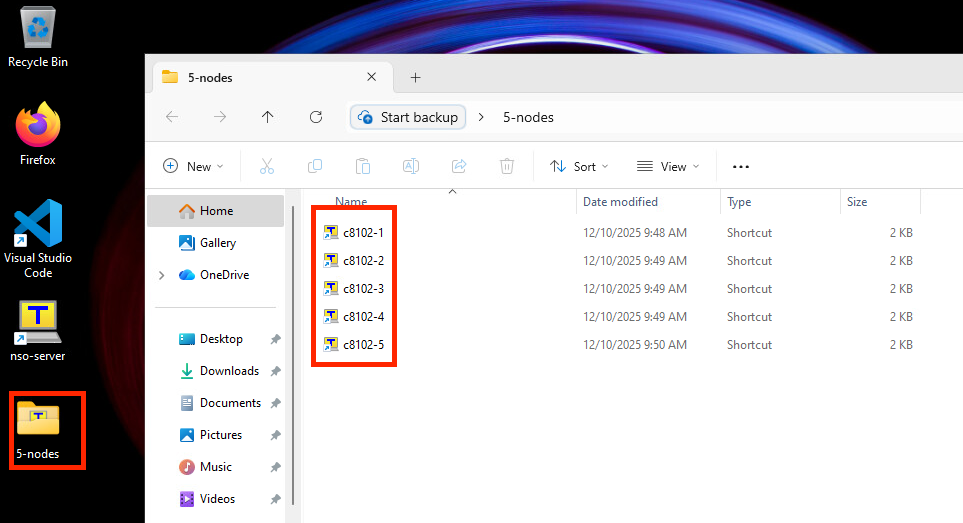

# Segment Routing ハンズオン

このハンズオンでは、CML 上の Cisco 8000 (IOS XR) ルータを使って SR-MPLS の基本設定から L3VPN、SR-TE、EVPN までを順に体験します。

## ラボ一覧

| No. | ラボ |
|:---:|:---|
| 01 | [SR-MPLS 基本設定](01-sr-mpls-basic/index.md) |
| 02 | [L3VPN](02-l3vpn/index.md) |
| 03 | [SR-TE Explicit Path](03-srte-explicit/index.md) |
| 04 | [SR-TE Dynamic Path](04-srte-dynamic/index.md) |
| 05 | [EVPN VPWS](05-evpn-vpws/index.md) |
| 06 | [EVPN VPLS](06-evpn-vpls/index.md) |

## ラボについて

あらかじめ割り当てられた dCloud にアクセスしてください。

<https://dcloud2.cisco.com/dashboard/sessions>

アクセス後、右下の View という緑のボタンをクリックすることでトポロジが表示されます。

{ style="width:100%" }

その後、win11 をクリック、左のメニューから VM Console を選択します。

{ style="width:100%" }

Windows デスクトップが表示されたら Firefox を開き、ブックマークにある CML2 をクリックしてアクセスします。その後 5-nodes のトポロジをスタートさせてください。

{ style="width:88%" }

5-nodes のラボをクリックすると、下記のように今回使用するトポロジの詳細が確認できます。C8102-1〜C8102-3はPEルータ、C8102-4〜C8102-5はPルータとして、WindowsとUbuntuはCEとして動作します。下記の赤枠内の198.18.<strong>2</strong>0.227/24は198.18.<strong>1</strong>0.227/24の誤りとなります。テキストをクリックすると編集可能です。

{ style="width:99%" }

またデスクトップ上の 5-nodes フォルダを開くと、5 台のルータへのteraterm ショートカットが用意されています（初回のみ起動に 1, 2 分かかります）。

{ style="width:100%" }

## 次のステップ

環境にアクセスできたら [01. SR-MPLS 基本設定](01-sr-mpls-basic/index.md) に進んでください。
